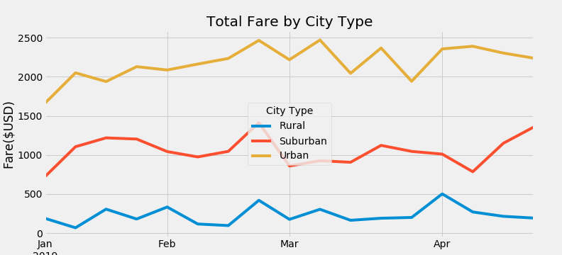

# PyBer_Analysis
Resources: Python 3.7.7; Conda 4.7.12

## Challenge Overview
The purpose of this assignment was to extract the exploratory data analysis and putting the data into a visualization on PyBer use by city type so that the company stakeholders can better support the system. The first technical deliverables included the exploratory analysis on PyBer data by city type ("Rural," "Suburban," "Urban") on Total Rides, Total Drivers, Total Fares, Average Fare per Rides, and Average Fare per Driver. I used the groupby method to count the total number of rides, sum the total number of drivers, and sum the total fares by each city type. Then, average fare per ride and average fare per drive was calculated by the total fares divided by the total rides and the total fares divided by the total drivers. Based on the summary report, we can assume as there are more drivers, there are more rides and more total fares such as urban cities. Also, we can assume that since there are few drivers in Rural areas, the average fare per ride is much higher than that of urban cities. According to the multiple-line graph, regardless of the time in the year, the urban area has the highest amount of fare compared to suburban and rural cities. This indicates that people ride more often in urban compare to the rural. 

While working on this assignment, I had several difficulties for the Technical Analysis Deliverables #2. The difficulties include, renaming columns for a new DataFrame, creating a new DataFrame using .copy(), converting a series into a DataFrame, and creating a multiple-lines graph. I was able to resolve these issues by googling the functions and looking for various examples of different data sets. For instance, I looked up how to use .copy from an old DataFrame into a new DataFrame. This inquiry showed a link to different examples of how to use copy() method. 

Base on the data from the different city types, I would recommend taking a survey in Rural cities to find out whether people want more PyBer drivers in town. The reason there's a lower number of drivers can be simply due to lack of need. If the demand is high in Rural cities, I would recommend that the CEO increase the number of Drivers using advertisements. Furthermore, we need further examinations on the price of each mile among different city types. For this current assignment, we weren't able to look at the cost per mile for the drive. It would be helpful to navigate whether the price is a contributing factor to a lower number of rides in Rural and Suburban cities compared to that of Urban cities. Another analysis we might perform is to look at bar graphs for cities in each city type to find any disparities among cities within a city type. This might give us another way to look at how PyBer is being utilized in each city and if there is any other trend within each city type. For this, I would perform the exploratory analysis on total rides, total drivers, total fares, average fare per rides, and average fare per driver like the previous analysis. Then, I will use groupby for each city (using a unique function) on the exploratory analysis. With the results, I will create bar graphs for all cities within a city type. 
